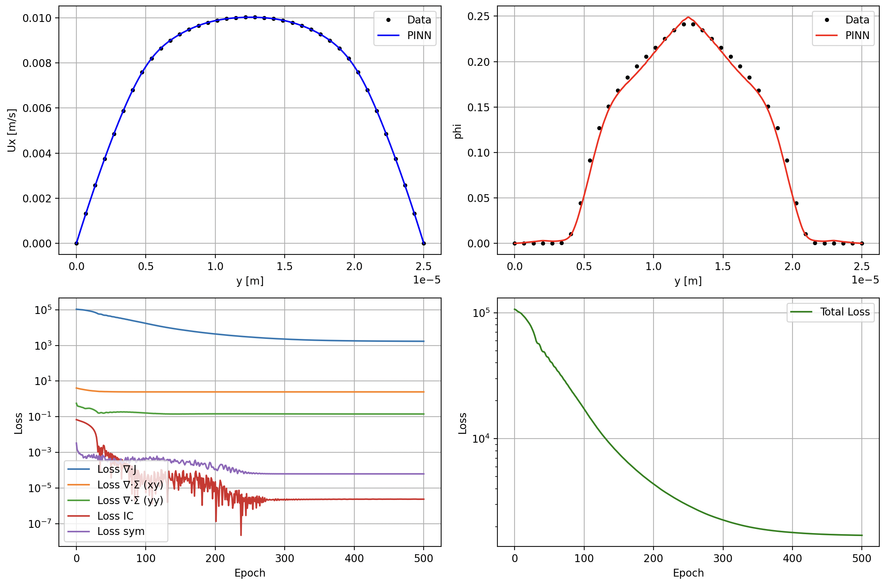
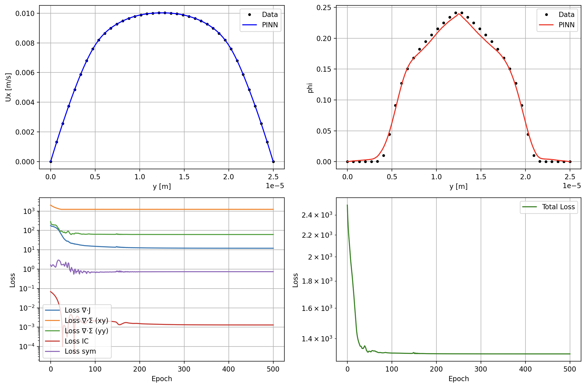

# Predicting shear-induced particle migration in channel flow with Physics-Informed Neural Networks

## Some Results

Using a standard PINN for the inverse problem (known velocity, unknown phi) with synthetic data:

Using a self adaptive PINN (SA-PINN) for the inverse problem (known velocity, unknown phi) with synthetic data:

## Scripts
	•	PINN_Ux_synthetic.py — fits Ux from synthetic data.
 	•	PINN_Ux_experimental.py — fits Ux from experimental data.
  
	•	PINN_phi_synthetic.py — predicts ϕ given a pre-saved Ux (no adaptive weights).
	•	SA-PINN_phi_synthetic.py — predicts ϕ given a pre-saved Ux (self-adaptive weights).
 
	•	SA-PINN_phi_experimental.py — predicts ϕ from pre-saved Ux (self-adaptive weights).
	•	SA-PINN_phi_&_Ux_coupled_experimental.py — jointly fine-tunes Ux while training ϕ (coupled) after loading a pre-saved Ux; does not converge (kept for completeness).
	•	SA-PINN_phi_&_Ux_single_experimental.py — single network to learn both Ux and ϕ simultaneously; does not converge (kept for completeness).

Differences across scripts are primarily to do with how loss terms are weighted/normalized (none vs. self-adaptive), whether data used are synthetic or experimental, and the order of training for Ux and ϕ (separate, simultaneous, or coupled). Self-adaptive weighting follows McClenny & Braga-Neto (PINN parameters via gradient descent, weights via gradient ascent) with one trainable weight per loss term per collocation point.

## General Overview
	•	Input files are .csv. Examples are provided in each folder.
	•	Coordinates: y ∈ [−1, 1] (normalized).
	•	Velocity: Ux ∈ [0, 1] (normalized).
	•	Volume fraction: ϕ is not normalized; the ϕ trial function enforces ϕ ∈ [0, ϕ_max] (ϕ_max = max packing).
	•	ϕ data (if present) are used only for visualization/validation, not for training, except for the average value of ϕ over y,
 		which is treated as a known value.

## Shared network architecture: 

All use Fourier features → 4×(Linear+Tanh) → Linear (64 neurons).

	•	Fourier scale varies by script (experimental data generally prefers smaller values; e.g., Ux ≈ 0.02 and ϕ ≈ 1.0 work well).
	•	Optimizer: Adam; optional LBFGS fine-tuning.
	•	Learning rates: 1e-3 for PINN params; 1e-3 (sometimes 1e-1) for adaptive weights.
	•	Random seed set for reproducibility.
	•	LR scheduler included; helps when losses plateau.
	•	A small LossHistory helper stores losses for plotting.

## Trial functions
	•	Ux trial: not normalized; includes factors (1−y)(1+y) to enforce wall Ux = 0.
	•	ϕ trial: mapped to [0, ϕ_max].

## Physics (loss terms for ϕ) — MSE over collocation points:
	1.	∇·J = 0 (migration flux divergence)
	2.	∂Σ_xy/∂y = 0 (stress gradient, xy)
	3.	∂Σ_yy/∂y = 0 (stress gradient, yy)
	4.	Symmetry about channel centerline
	5.	Mass conservation (average value of ϕ over y)

If training ϕ and Ux, Ux data are also included in the loss; if training Ux alone, the Ux data loss is the objective.

## How to Run

	1.	Train a Ux model (synthetic or experimental):
    - models_synthetic_data/PINN_Ux_synthetic.py
    - models_experimental_data/PINN_Ux_experimental.py

	2.	Predict ϕ using your preferred script (no-adaptive or self-adaptive), which loads the saved Ux model:
    - models_synthetic_data/PINN_phi_synthetic.py
    - models_synthetic_data/SA-PINN_phi_synthetic.py
    - models_experimental_data/SA-PINN_phi_experimental.py
    - models_experimental_data/SA-PINN_phi_&_Ux_coupled_experimental.py

	or 

 	1. Ux and ϕ are trained simultaneously within the same script for the following script, which uses a single neural network for each output:
    - models_experimental_data/SA-PINN_phi_&_Ux_single_experimental.py

## Weighting & Normalization Notes

No adaptive weights alongside normalizing certain loss terms (see PINN_phi_synthetic.py) seems to give the sharpest final fit when certain terms, but this may be negligible when using experimental data because of the low Fourier scale values that are required. Also, the scripts that do use the adaptive weights converge slightly faster, but this may also be negligible when using experimental data for the same reason.

## References

Dbouk, Talib, Elisabeth Lemaire, Laurent Lobry, and Fady Moukalled. “Shear-induced particle migration: Predictions from experimental evaluation of the particle stress tensor.” Journal of Non-Newtonian Fluid Mechanics 198 (2013): 78–95. DOI: 10.1016/j.jnnfm.2013.03.006

McClenny, Levi D., and Ulisses M. Braga-Neto. “Self-adaptive physics-informed neural networks.” Journal of Computational Physics 474 (2023): 111722. DOI: 10.1016/j.jcp.2022.111722

Tancik, Matthew, et al. “Fourier features let networks learn high frequency functions in low dimensional domains.” arXiv:2006.10739 (2020).

Bilionis, Ilias¹; Hans, Atharva². A Hands‑on Introduction to Physics‑Informed Neural Networks. ¹ Mechanical Engineering, Purdue University, West Lafayette, IN; ² Design Engineering Lab, Purdue University, West Lafayette, IN.
