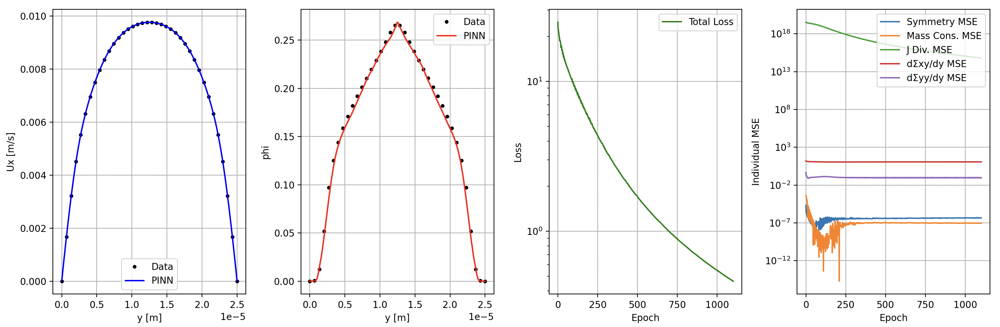
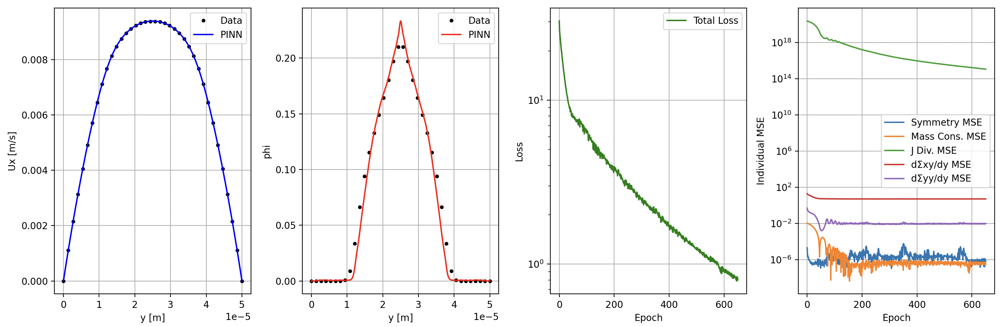
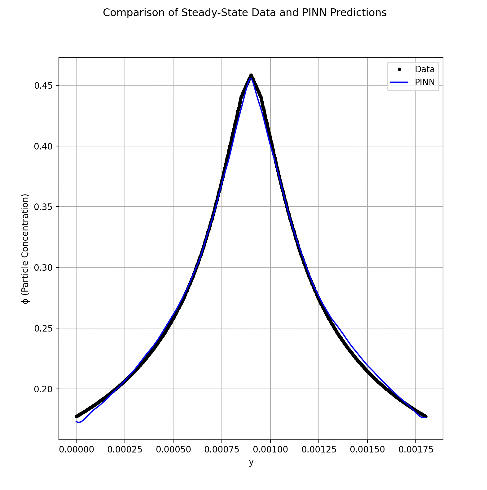
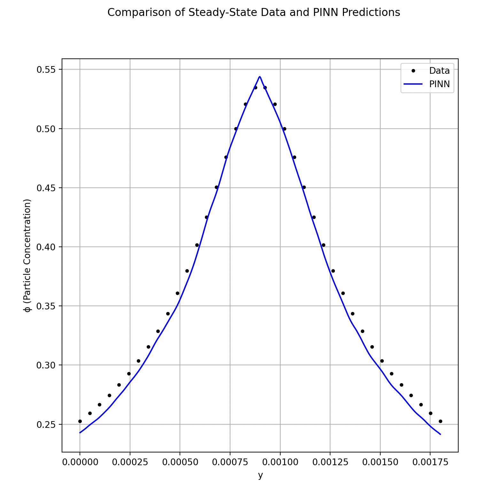
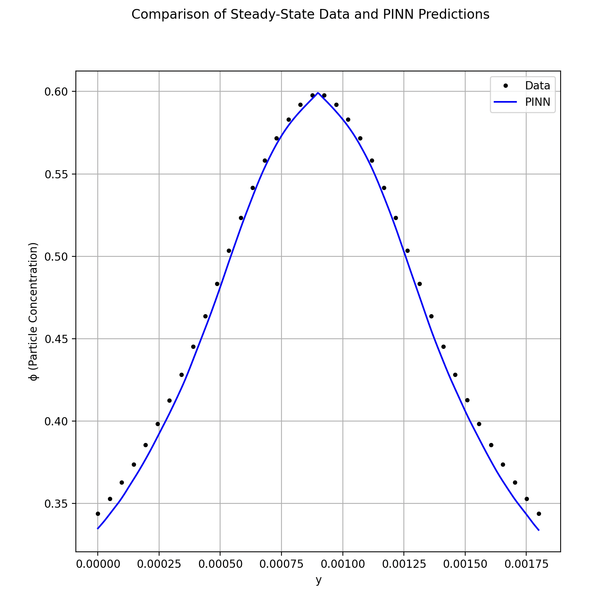

# Predicting shear-induced particle migration in channel flow with Physics-Informed Neural Networks

This repository contains PyTorch implementations of physics-informed neural networks (PINNs), which learn the known velocity profile of fluid through a small channel, and use this along with enforced physical laws to approximate the unknown particle-volume-fraction profile of particle suspensions. Later models, such as pinn_sbm_lift_force_7.py, include a lift force term to describe the deformable body behavior of red blood cells, resulting in greater concentrations towards the center flow, and values of zero for the concentration near the walls. 

## Results

See the image below for the results for a channel width is 25 micrometers, beta (lift force parameter) is 1.1, and bulk concentration is 0.2. Notice the zero values for the particle-volume-fraction near the walls. The model learned this entirely by enforcing the governing equations and boundary conditions.

See the image below for the results for a channel width is 50 micrometers, beta (lift force parameter) is 1.2, and bulk concentration is 0.1. All other parameters are the same as for the previous image. Notice the large zero regions near the walls, which are correctly predicted by the model.  

The following three images are of models which do not include a lift force for modeling blood flow

  

## References
Dbouk, Talib, Elisabeth Lemaire, Laurent Lobry, and Fady Moukalled. "Shear-induced particle migration: Predictions from experimental evaluation of the particle stress tensor." Journal of Non-Newtonian Fluid Mechanics 198 (2013): 78–95. DOI: 10.1016/j.jnnfm.2013.03.006

McClenny, Levi D., and Ulisses M. Braga-Neto. "Self-adaptive physics-informed neural networks." Journal of Computational Physics 474 (2023): 111722. DOI: 10.1016/j.jcp.2022.111722

Tancik, Matthew, Pratul P. Srinivasan, Ben Mildenhall, Sara Fridovich-Keil, Nithin Raghavan, Utkarsh Singhal, Ravi Ramamoorthi, Jonathan T. Barron, and Ren Ng. "Fourier features let networks learn high frequency functions in low dimensional domains." arXiv preprint arXiv:2006.10739 (2020). arXiv:2006.10739
